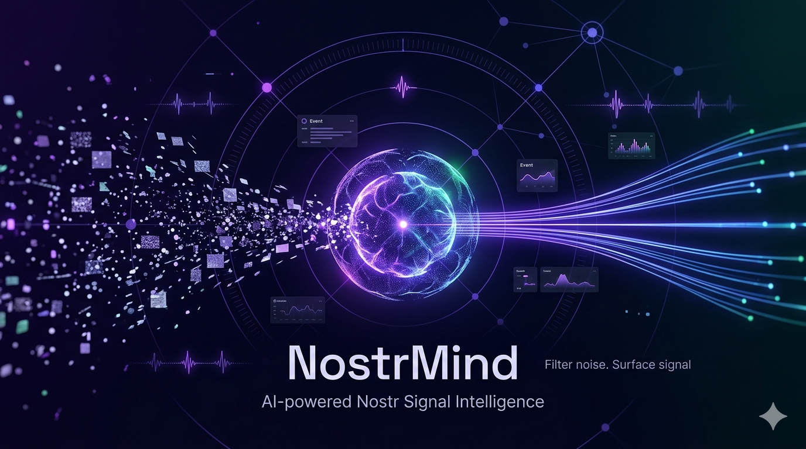

# NostrMind

<p align="center">
  
</p>

<p align="center">
  
</p>

**Turn Nostr noise into verified opportunities — automatically.**

NostrMind is a config-driven, AI-powered intelligence worker for Nostr.
It runs 24/7, filters high-volume relay traffic, scores relevance with your chosen AI stack, stores structured insights in SQLite, and can instantly DM you when a high-value signal appears.

Built for builders, founders, researchers, and teams that need signal fast.

---

## Why NostrMind gets attention

- **Practical ROI**: catches opportunities and trend shifts while you sleep.
- **Low-friction ops**: one simple config, one process, one Docker compose.
- **Local-first economics**: run Ollama locally, fail over to cloud AI only when needed.
- **Agent-ready API**: query previously validated insights via a bridge endpoint.
- **Production-minded core**: deduplication, throttled AI queue, persistent history, live dashboard.

---

## Who it is for

- **Founders / GTM teams**: watch for lead intent, product mentions, competitor chatter.
- **Crypto / market analysts**: monitor specific narratives (e.g. Bitcoin L2s) with strict filtering.
- **Open-source teams**: track project mentions and community feedback in real time.
- **AI agent builders**: consume curated signals instead of raw relay firehose.
- **Nostr power users**: tame the noise and surface only what matters to you.

---

## Usage by example

### 1) Lead generation while you sleep

You run a dev agency and want inbound opportunities.
NostrMind tracks hiring intent, urgent build requests, and collaboration posts, then surfaces only high-intent signals you can act on immediately.

### 2) Narrative tracking for market conviction

You are watching a theme like Bitcoin L2 momentum.
NostrMind filters noise, validates discussion quality with AI, and highlights the conversations most likely to move sentiment.

### 3) Brand + product mention radar

You are launching a product and need fast feedback loops.
NostrMind catches meaningful mentions, complaints, and praise so your team can respond early, improve messaging, and build stronger community trust.

### 4) Founder command center

You manage multiple goals at once (sales, reputation, trends).
NostrMind lets you run multiple monitoring tracks in one place, so your attention goes to validated opportunities instead of endless scrolling.

---

## Config customization (no-code control)

NostrMind is designed so non-developers can still shape outcomes precisely.

You can customize:

- **What matters**: define the exact topics and intent you care about.
- **How strict matching should be**: broad discovery vs high-precision alerts.
- **How often signals are evaluated**: balance speed and cost.
- **How alerts are phrased**: tailor tone for yourself or your team.
- **How private or cloud-based your setup is**: choose local-first, cloud-first, or hybrid.

This gives teams strategic control without rebuilding infrastructure.

---

## How it works (3-stage signal pipeline)

1. **Relay ingestion**: subscribes to configured Nostr relays.
2. **Quick filter sieve**: cheap local filtering + processed-event dedup.
3. **AI intelligence gate**: strict pass/fail decision with clear reasoning and action suggestions.

Only meaningful events become insights. Everything else is dropped early for cost and speed.

---

## Quick start

### 1) Install

```bash
npm install
```

### 2) Create config

```bash
cp nostr-mind.config.json.example nostr-mind.config.json
```

### 3) Edit config

Configure:

- your monitoring goals
- your preferred AI mode
- your notification destination
- your watch themes

### 4) Run

```bash
npm run dev
```

Dashboard: http://localhost:3000

Production:

```bash
npm run build
npm start
```

---

## Docker (recommended for 24/7)

```bash
docker compose up -d --build
```

Mounts:

- `./nostr-mind.config.json` → `/app/nostr-mind.config.json` (read-only)
- `./data` → `/app/data`

Port:

- `3000:3000`

---

## Intelligence modes

- **Private-first**: run mostly local for maximum control.
- **Cloud-accelerated**: prioritize speed and strongest model quality.
- **Hybrid**: default local and fall back to cloud when needed.

Choose the mode that fits your budget, privacy needs, and expected volume.

---

## API + dashboard

When dashboard is enabled, you get a live operational view of:

- overall system health
- signal volume and trend movement
- watch performance across active monitoring tracks
- real-time event activity

This makes NostrMind easy to trust in production and easy to demo to clients or stakeholders.

---

## DM alerts that feel actionable

NostrMind can send instant, high-context alerts when a strong match is detected.

Each alert can include:

- what was found
- why it matters
- where to jump in
- what to do next

The result is notifications that drive action, not just awareness.

---

## Example watchlist ideas

- "Find posts where teams are actively hiring TypeScript backend developers."
- "Track strong mentions of my product or brand names."
- "Alert me to meaningful discussions around Bitcoin L2 scaling narratives."
- "Detect recurring complaints that reveal product gaps in a niche."

---

## Reliability notes

- Processed events are tracked per watchlist to avoid duplicate work.
- Config watchlists are seeded without overwriting dashboard-managed entries.
- AI throughput is rate-limited with a queue and backpressure handling.
- Restart after config changes.

---

## Security

- Never commit API keys or private keys.
- Treat notification keys and provider credentials as secrets.
- Prefer environment-specific config handling in production.

---

## Project status

NostrMind is actively evolving. Feedback, issues, and PRs are welcome.

If you want a custom deployment or a tailored signal strategy for your team, open an issue with your use case.
